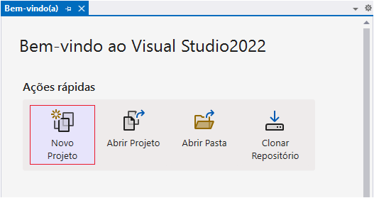
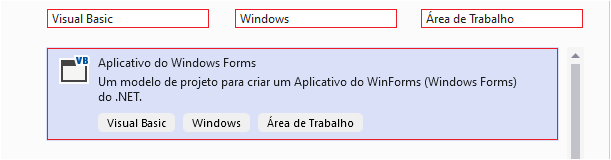
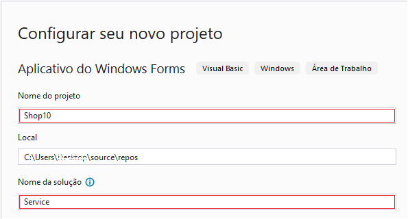
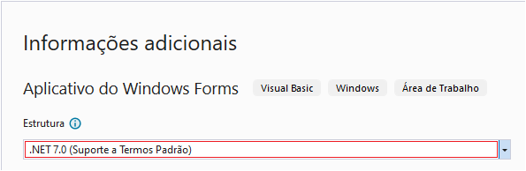

# Criar um aplicativo do Visual Basic .NET
Splash Screen - Artigo August 24, 2023

Primeiro, você criará um projeto de aplicativo do Visual Basic. O modelo de projeto padrão inclui todos os arquivos necessários para um aplicativo executável.

1. Abra o Visual Studio.

2. Na tela Iniciar, selecione criar um **Novo Projeto**.
   


3. Na janela **criar um novo projeto**, escolha **Visual Basic** na lista Linguagem. Em seguida, escolha **Windows** na lista Plataforma e **Área de Trabalho** na lista Tipos de projeto.

4. Depois de aplicar os filtros dessa linguagem, plataforma e tipo de projeto, escolha o modelo **Aplicativo Windows Forms** e, em seguida, escolha **Avançar**.



5. Na janela configurar seu novo projeto, insira **Shop10** na caixa Nome do projeto. Em seguida insira **Service** na caixa Nome da solução, escolha **Avançar**.



6. Na janela informações adicionais, o **.NET 6.0 (Suporte de Longo Prazo)** já deve estar selecionado para sua estrutura de destino. Caso contrário, selecione **.NET 7.0 (Suporte a Termos Padrão)**. Em seguida, escolha **Criar**.



O Visual Studio abre seu novo projeto.


# Variáveis

Geralmente, _variável_, ou _var_ em C# (Visual C-Sharp), é o nome usado para definir um ou mais valores que são manipulados pelos programas durante seu funcionamento.

## Sobre o repositório

Aqui, neste repositório, veremos um passo a passo das variáveis mais utilizadas para poder começar a programar.

É um imenso prazer:

Me chamo Fábio Santos, e este é meu primeiro contato com a linguagem de programação C# (Visual C-Sharp). Nasci em meados dos anos 80 e tenho um conhecimento rápido de QBasic (Microsoft QuickBASIC) e Assembly para processadores 80x86 e um conhecimento mais profundo em Visual Basic.

Bem-vindo!

## Sintaxe

&nbsp;&nbsp;&nbsp;&nbsp;[ _access_ ( **`VAR` | _type_** ) _name_ = { _value_ } ]

### Parâmetros

#### _access_ [opcional]

   + **`Public`** A palavra-chave `Public` na instrução de declaração especifica que o elemento pode ser acessado a partir do código em qualquer lugar do mesmo projeto, em outros projetos que referenciam o projeto e em qualquer assembly criado a partir do projeto.
   + **`Protected`** A palavra-chave `Protected` na instrução de declaração especifica que o elemento só pode ser acessado de dentro da mesma classe ou de uma classe derivada dessa classe.
   + **`Friend`** A palavra-chave `Friend` na instrução de declaração especifica que o elemento pode ser acessado no mesmo assembly, mas não de fora do assembly.
   + **`Private`** A palavra-chave `Private` na instrução de declaração especifica que o elemento só pode ser acessado no mesmo módulo, classe ou estrutura.
   + **`Protected Friend`** A combinação de palavras-chave `Protected Friend` na instrução de declaração especifica que o elemento pode ser acessado nas classes derivadas, no mesmo assembly ou em ambos.
   + **`Private Protected`** A combinação de palavras-chave `Private Protected` na instrução de declaração especifica que o elemento só pode ser acessado na mesma classe, bem como nas classes derivadas encontradas no mesmo assembly que a classe relativa.

#### _`type`_

+ **`bool`** 1-bit  (2^1), com sinal (0) [ true | false ], depende da implementação da plataforma.
+ **`sbyte`** 8-bits ((2^8)/2)-1, com sinal (-128 a 127).
+ **`byte`** 8-bits (2^8)-1, sem sinal (0 a 255).
+ **`char`** 16-bits (2^16)-1, sem sinal (0 a 65535) sintaxe 'A' e não "A".
+ **`short`** 16-bits ((2^16)/2)-1, com sinal (-32768 a 32767 ), **System.Int16**.
+ **`ushort`** 16-bits (2^16)-1, sem sinal (0 a 65535) **System.UInt16**, **`WORD`**.
+ **`int`** 32-bits ((2^16)/2)-1, com sinal (-2147483648 a 2147483647 ) **System.Int32**.
+ **`uint`** 32-bits (2^32)-1, sem sinal (0 a 4294967295) **System.UInt32**, DoubleWORD (**`DWORD`**).
+ **`long`** 64-bits ((2^64)/2)-1, com sinal (-9223372036854775808L a 9223372036854775807L) **System.Int64**.
+ **`ulong`** 64-bits (2^64)-1, sem sinal (0L a 18446744073709551615L) **System.UInt64**.
+ **`float`** 32-bits, FLOAT, -1.175494351E-38F a 3.402823466E+38F **System.Single**.
+ **`double`** 64-bits, DoubleFLOAT, -2.2250738585072014E-308 a 1.7976931348623158E+308 **System.Double**.
+ **`decimal`** 96-bits  int/float (-79228162514264337593543950335M a 79228162514264337593543950335M) **System.Decimal**.
+ **`string`** 2 bilhões de caracteres Unicode.
+ **`object`** 32-bits ou 64-bits sendo possível armazenar qualquer tipo em uma variável do tipo Object.

> Nota: sempre use o sufixo literal forçado L/UL ou l/ul para diferenciar o tipo long e ulong do padrão int, use F ou f para diferenciar o tipo float do padrão double racional, use M ou m para distinguir decimal de todos os outros valores numéricos. Também podemos usar o prefixo literal @ (verbatim) para ignorar comandos de string ou $ (interpolar) para aceitar e converter  comandos {variáveis} e \x0041 em string.

#### _name_

+ Um nome válido para descrever procedimentos, tipos de dados ou objetos.

#### _value_

+ Um valor de atribuição para dados char 'a', string "a", números 123 ou até mesmo objeto.

## Literais e conversões

> Dica: podemos converter valores, desde que tenham possibilidade de conversão. Não podemos converter um "rato" em "elefante"! As possíveis conversões são _numéricas_ em tipos de números, _não numéricas_ em tipos de textos e também _classes_, _(diversas)_ em tipos de objetos.

var SignedByte = (sbyte)42;<br>
uint UnsignedInt = (uint)SignedByte;

## Exemplo
```csharp
using System;
namespace variable_type
{
    public partial class VariableType : System.Windows.Forms.Form
    {
        public VariableType()
        {
            InitializeComponent();
        }
        private void button1_Click(object sender, System.EventArgs e)
        {
            // statements //////////////////////////////////////////////////////////////
            var Int_EmployeeID = 1;
            var Str_LastName = "Hejlsberg";
            var Str_FirstName = "Anders";
            var Chr_Gender = 'M';
            var Date_BirthDate = System.DateTime.Parse("2/12/1960", new System.Globalization.CultureInfo("pt-BR"));
            var Int_Age = System.DateTime.Now.Year - Date_BirthDate.Year; // metadados
            var Sng_Salary = 92400.55F;
            var Str_CurrencyType = string.Format(new System.Globalization.CultureInfo("pt-BR"), "{0:C}", Sng_Salary); // metadados
            var Bool_Deleted = false;
            var Bool_Enabled = true;
            var Str_Notes = "Anders Hejlsberg é um engenheiro de software dinamarquês que ganhou prestígio pelo desenvolvimento do Delphi e Turbo Pascal na Borland e a plataforma .NET após ter migrado para a Microsoft. Projetista Chefe da linguagem C#.";
            var Obj_Photo = new System.Drawing.Bitmap("./res/empid1.png", true);
            // fields //////////////////////////////////////////////////////////////////
            this.textBox1.Text = $"{Int_EmployeeID}";
            this.textBox2.Text = Str_LastName;
            this.textBox3.Text = Str_FirstName;
            this.textBox4.Text = $"{Chr_Gender}";
            this.textBox5.Text = $"{Date_BirthDate.Day}/{Date_BirthDate.Month}/{Date_BirthDate.Year}";
            this.textBox6.Text = $"{Int_Age}";
            this.textBox7.Text = $"{Str_CurrencyType}";
            this.checkBox1.Checked = Bool_Deleted;
            this.checkBox2.Checked = Bool_Enabled;
            // notes ///////////////////////////////////////////////////////////////////
            this.textBox8.Multiline = true;
            this.textBox8.Size = new System.Drawing.Size(383, 64);
            this.textBox8.ScrollBars = System.Windows.Forms.ScrollBars.Both;
            this.textBox8.WordWrap = true;
            this.textBox8.Text = Str_Notes;
            // photo ///////////////////////////////////////////////////////////////////
            this.pictureBox1.BackColor = System.Drawing.ColorTranslator.FromHtml("#000000");
            this.pictureBox1.SizeMode = System.Windows.Forms.PictureBoxSizeMode.Zoom;
            this.pictureBox1.Image = Obj_Photo;
        }
    }
}
```

## Captura de tela


Explore, no [repositório](https://github.com/fabasapro/variable-type/tree/main), este código simples para iniciantes.
